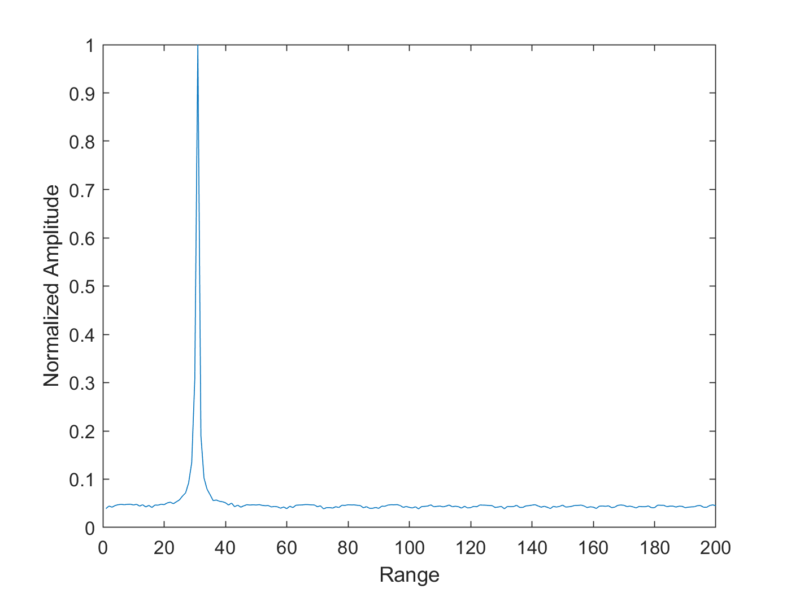
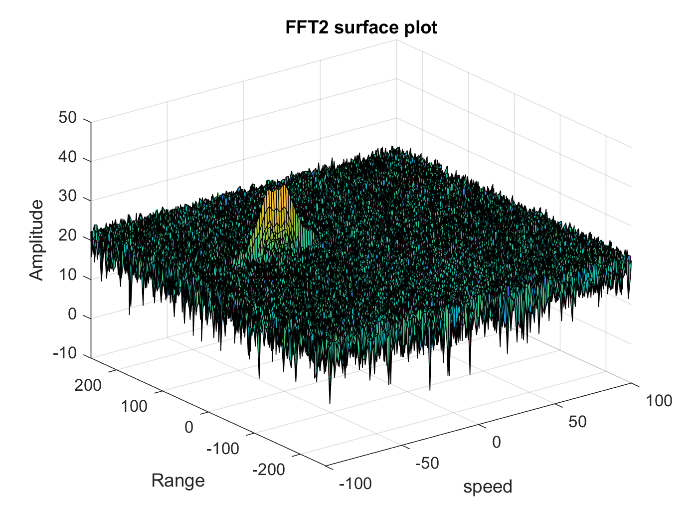
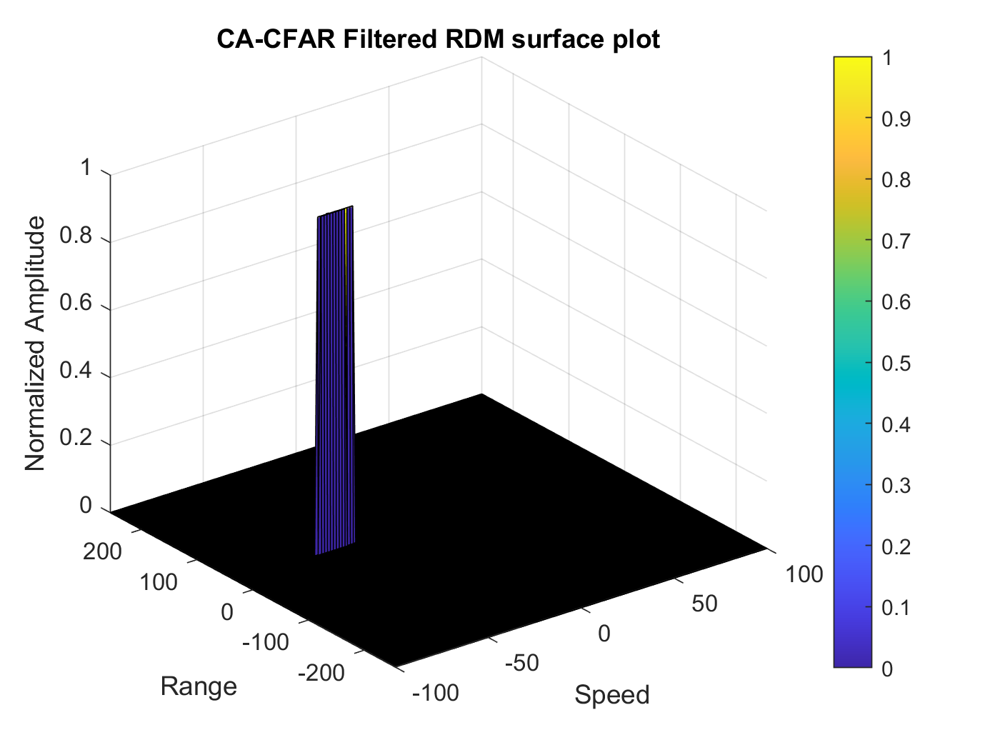
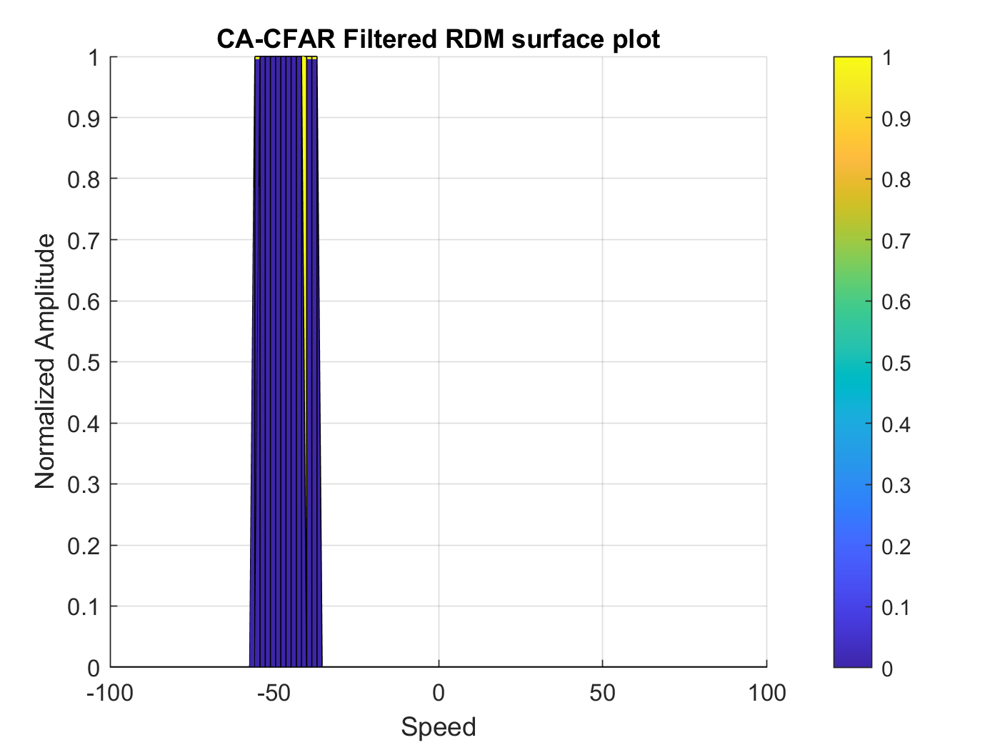
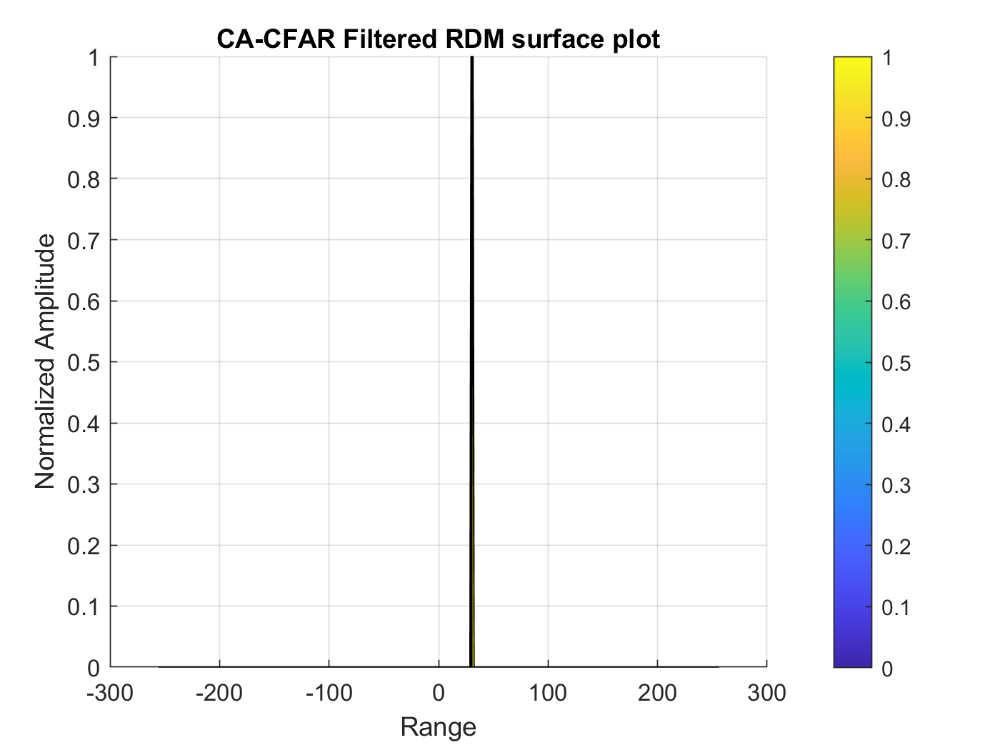

# SFND Radar Target Generation and Detection
The aim of the project is to, calculate the FMCW design waveform parameters, simulate target generation and detection with a radar sensor, and perfom 2D CFAR on generated data.

# Radar Specifications
For the project the radar specifications are as follows:
* Frequency of operation = 77GHz
* Max Range = 200m
* Range Resolution = 1 m
* Max Velocity = 100 m/s

For my project I chose -50 m/s and 30 m as the initial position and velocity,

# Results
* The first step is to implement the range FFT on the beat signal and plot the result. 
<p align="center">

</p>

From the image above we see a spike at the selected position [30 m]

* Also the 2D FFT output is generated to form the Range Doppler Map
<p align="center">

</p>

* For the 2D-CFAR process a detailed code excerpt explains the process:
```
% Number of training and guard cells in both dimensions
Tcr = 20;
Tcd = 8;

Gcr = 12;
Gcd = 6;

% offset value
offset = 1.5;

% range and doppler sizes
train_range_size = (2*Tcr +2*Gcr + 1);
train_doppler_size = (2*Tcd +2*Gcd + 1);

% vector to store grid size
gridSize = train_range_size*train_doppler_size;
numTrainCell = gridSize - (2*Gcr + 1)*(2*Gcd + 1);

% storage for cell under test
CUT = zeros(size(RDM));

% loop through range and doppler
for i = 1:(size(RDM,1) - train_range_size)
    for j = 1:(size(RDM,2) - train_doppler_size)
        % obtain the index for current cell under test
        r_index = i + Tcr + Gcr;
        d_index = j + Tcd + Gcd;
        
        % for current patch, convert log to linear
        trainPatch = db2pow(RDM(i:i+train_range_size,j:j+train_doppler_size));
        
        % make none training cell regions = zero
        trainPatch(Tcr+1:end-Tcr, Tcd+1:end-Tcd) = 0;
        
        % calculate average noise level multiplying by offset
        noise_lvl = offset * pow2db(sum(sum(trainPatch))/numTrainCell);
        
        % check if RDM value is greater than signal
        if RDM(r_index, d_index) > noise_lvl
            CUT(r_index, d_index) = 1;
        end                 
    end
end
```

The outputs after signal processing are shown below
<p align="center">

</p>

<p align="center">

</p>

<p align="center">

</p>

